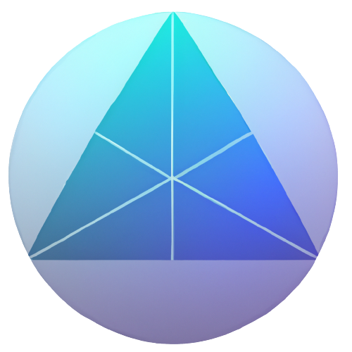

<div align="center">


<br><br>

<h1><strong> Next Web3 Boilerplate </strong></h1>

[](https://github.com/Pedrojok01/Next-Web3-Boilerplate/stargazers)
[](https://github.com/Pedrojok01/Next-Web3-Boilerplate/issues)
[](https://github.com/Pedrojok01/Next-Web3-Boilerplate/issues)
[](https://github.com/Pedrojok01/Next-Web3-Boilerplate/blob/main/License)
[](https://www.linkedin.com/in/pierre-e/)


<br></br>


</div>

## Table of Contents

- [Table of Contents](#table-of-contents)
- [Update:](#update)
- [Description](#description)
- [Built With](#built-with)
- [Installation](#installation)
  - [Make sure you have the following ready:](#make-sure-you-have-the-following-ready)
  - [Once your config is ready, create a new repo, open your favorite code editor, and clone the repo with the following cmd:](#once-your-config-is-ready-create-a-new-repo-open-your-favorite-code-editor-and-clone-the-repo-with-the-following-cmd)
  - [Install all package dependancies by running:](#install-all-package-dependancies-by-running)
  - [Add your API keys in the .env file:](#add-your-api-keys-in-the-env-file)
  - [To start the Next-Web3-Boilerplate:](#to-start-the-next-web3-boilerplate)
- [Features:](#features)
- [⭐️ ... and don't forget to leave a star if you like it! ⭐️](#️--and-dont-forget-to-leave-a-star-if-you-like-it-️)


## Update:

2024-02:

- Switched to Next.js v14;
- Switched to Viem & Wagmi v2;
- Add support for  `Linea`, `lineaTestnet`, `Bsc` & `bscTestnet` networks;
- Bump all dependencies to latest versions;


## Description

Simple and minimalist Web3 boilerplate to boost your Dapp development. Built using the latest tech outhere: [Next.js](https://nextjs.org/), [Viem](https://viem.sh/), [Wagmi](https://wagmi.sh/), [RainbowKit](https://www.rainbowkit.com/), [ChakraUI](https://chakra-ui.com/) and [Typescript](https://www.typescriptlang.org/). Eslint, Prettier and Husky already configured. The perfect starting point for your next web3 project.

Try it yourself: [https://next-web3-boilerplate.com/](https://next-web3-boilerplate.com/)

## Built With

- [![nextjs]][nextjs-url]
- [![typescript]][typescript-url]
- [![chakraui]][chakraui-url]
- [![viem]][viem-url]
- [![wagmi]][wagmi-url]
- [![Rainbowkit]][rainbowkit-url]
- [![prettier]][prettier-url]
- [![ESLint]][eslint-url]

## Installation

### Make sure you have the following ready:

- [node.js](https://nodejs.org/) installed (developped on LTS v18)
- [typescript](https://www.typescriptlang.org/) installed (developped on v5.2.2)
- [bun](https://bun.sh/) or [pnpm](https://pnpm.io/) or [yarn](https://yarnpkg.com/) or [npm](https://www.npmjs.com/) installed
- [MetaMask](https://metamask.io/) (or any web3 compatible wallet) installed in your browser

### Once your config is ready, create a new repo, open your favorite code editor, and clone the repo with the following cmd:

```bash
git clone https://github.com/Pedrojok01/Next-Web3-Boilerplate.git .
```

### Install all package dependancies by running:

```bash
bun install
# or
pnpm install
# or
yarn install
# or
npm install
```

<b>IMPORTANT: Double check your package.json to make sure you've installed the exact same version for all @web3-react packages. Since the version 8+ is still in beta, it may not be automatically installed.</b>

### Add your API keys in the .env file:

Remove the `.example` from the `.env.example` file name at the root of the project and add you API keys inside. The WalletConnect project ID is now required since the v2 update. The can create one easily on the [WalletConnect dashboard](https://cloud.walletconnect.com/).

```js
NEXT_PUBLIC_WALLETCONNECT_PROJECT_ID = "Project ID needed for WalletConnect v2 here";
```

### To start the Next-Web3-Boilerplate:

First, run the development server:

```bash
bun dev
# or
pnpm dev
# or
yarn dev
# or
npm run dev
```

Open [http://localhost:3000](http://localhost:3000) with your browser to see the result.

## Features:

- [x] Web3 Wallet Status (MetaMask / Rainbow / Coinbase Wallet / WalletConnect)
- [x] Chain selector
- [x] Block Number / Chain ID & Name
- [x] Wallet balance
- [x] Sign Messages & Transfer Native
- [x] Dark mode support
- [x] Hook to query user's Token Balances

<br></br>

<div align="center">
<h2> Enjoy!!!</h2>

<br>

## ⭐️ ... and don't forget to leave a star if you like it! ⭐️

</div>

<p align="right">(<a href="#top">back to top</a>)</p>

<!-- MARKDOWN LINKS & IMAGES -->

[nextjs]: https://img.shields.io/badge/Next.js_v14.1-000000?style=for-the-badge&logo=next.js&logoColor=FFFFFF
[nextjs-url]: https://nextjs.org/
[typescript]: https://img.shields.io/badge/typescript_v5.3.3-375BD2?style=for-the-badge&logo=typescript&logoColor=61DAFB
[typescript-url]: https://www.typescriptlang.org/
[chakraui]: https://img.shields.io/badge/ChakraUI-purple?style=for-the-badge&logo=ChakraUI&logoColor=319795
[chakraui-url]: https://chakra-ui.com/
[wagmi]: https://img.shields.io/badge/Wagmi-35324a?style=for-the-badge&logo=data:image/png;base64,iVBORw0KGgoAAAANSUhEUgAAAGQAAABkCAYAAABw4pVUAAAAAXNSR0IArs4c6QAAAARnQU1BAACxjwv8YQUAAAAJcEhZcwAADsMAAA7DAcdvqGQAAAW5SURBVHhe7ZvbT1RHHMe/LHcQZLnsNoBsBFyh0JJWU6SJFVOflNXEBpNaaNFS47W3WLQPDdbHmoiIWltp7T9QAVtti2iLb7U+aMCG0Ad88KFULgEakHvP7zAYoex6ds/u5gf+PsmGmVmyhzmfmd/Mcn4TYrVapyGwwaJ+CkwQIcwQIcwQIcwQIcwQIcwQIcwQIcwQIcwQIcwQIcwQIcwQIcwQIcwQIcwQIcwQIcwQIcwQIcwQIcwQIcwQIcwQIcwQIcwQIcwQIcwQIcwQIcwQIcwQIcwIjY6OPqbKPhMeHg6bzYa0tHRMTU3i0aNH6h3/YrUmwuHIQExsLEa1a0xOTqp3/EdERARsdjscGRkYHR3VX8HE9PmQ3Nzn8W5lJVauzERMTAz6+/pw+XITmpoaMTIyon7LHPHx8SgrK8f69a8hwWrF2NgY7t69g+8ufouuri5MT/vniEvhunXYVbEb9ufsiNWkP3jwAJcufY9rzc1BE2NKiM1mx9mz57Bm7VqEhYXpbXRz/h0awvHjn+udGR8f19t9hUbsnj17sXffPsTFxSEkJERvJym3b/+Bgwf2o6enR28zQ1FREaqPHUdOTg4slplIPjU1hcHBQVRXf4amxka9HmhMrSGlpaV4pbDwsQyCblicNqL3HziApKQk1eo7KVooLN2xQ58lszIIElVU9Cq2b38DoaGhqtU3tLANl2urNttzH8sgqJyQkIDDh6u0Poar1sBiSsiGDcVzbtKTUAh74cWCOR30hdVOp/ZZK1VtLnTt1zdtMn2N5csT8NLLa9z2ZcWKFSguLla1wGKqJ9HamuGJ2Ke8b4SkpBRVWphVq5ymhdAMp3DoCQplwcBcT4KC5yUuOTnZ7cj2J5GRkaoUWBaBkMDfbE4s+hmy1JAZwoxFIOTZQkIWMyRkMUNmCDNkhjBDFnVmSMhihoQsZsgMYYbMEGbIos4MCVnMCKiQlBSb6WcVlGHyLBFQIc7VTtNCCgoKVMk9aWlpquQb0THR+mNaDgRUSEmJCzk5uarmPVlZWdi8eYuquaey8j09BckX6Engzjd3+jxw6PGx1WpFZmYWnE6n9jdnw26367lqvhBQIZTbVHu6Di6XC9bERNX6dKhDW7dtw8maU4Zu9Ftl5ag6chSZmsAnM2A8QTeMZt+HH32MsvK3Vat3kMwtJSWoOVWLK1euouX6r/jp519Q/81F7N23X5913oo2lZf1w49XDYWU3t5edHZ24v79Lj2RbspNYpvFEqLnejkcDmRnZ+uZikahPK2Ojg7tWj34S7vWmId8MEopSk1NRUaGQ89oMTKa607X4sSJL1RthkOHPsA7uypg09bK+VD2ZmvrbzhS9Qn6tD4bJShCZpmYmNDTP91lGtJoohFuNs+Ksgw9ZTPS59N1vBm984Vs3LgRdWfO6XLdQf09U3catbWnDKe9BnXbSzeBpnlUVNSCL3rPrAzC0zXoRTPC7GaDwuSyZctUbWGovxW7dhsOo0RQhSwVKLEuLy/PUD4YZT56I1+EGITWqFlos2KxmJ/JC2FKSH9/vyotfdra2lQJ6O7+G0NDQ6rmX0wJaWm5pkpLm4cPH+LWrd9VDfoC3dTYYGih/vPePa+y5s0JudaM9vZ2VVua0BmXT48ewfDwsGqZoaHhkqEIUVNzUt9tGcX0gZ38/HwcPPg+8rSfoaHkd/4CRh+/+Npo1/xPdzfOn/8SN25cX/CcC/0n4fxXF7Rv6ZlzvsvQlntgYAD1F75Gff2F/8n0hGkhs6Smpnm1veMOHc2jg0BPO56Xnp6uny2h3dQsk1qIunvnDm7ebPX6FJnfhAj+Qba9zBAhzBAhzBAhzBAhzBAhzBAhzBAhzBAhzBAhzBAhzBAhzBAhzBAhzBAhzBAhzBAhzBAhzBAhzBAhzBAhzBAhzBAhzBAhzBAhzBAhzBAhzBAhzBAhzBAhzBAhzBAhrAD+A51VcvKQFC4uAAAAAElFTkSuQmCC
[wagmi-url]: https://wagmi.sh/
[Rainbowkit]: https://img.shields.io/badge/Rainbowkit-006600?style=for-the-badge&logo=data:image/svg+xml;base64,PHN2ZyB4bWxucz0iaHR0cDovL3d3dy53My5vcmcvMjAwMC9zdmciIGZpbGw9Im5vbmUiIHZpZXdCb3g9IjAgMCAxMjAgMTIwIj48cGF0aCBmaWxsPSJ1cmwoI2EpIiBkPSJNMCAwaDEyMHYxMjBIMHoiLz48cGF0aCBmaWxsPSJ1cmwoI2IpIiBkPSJNMjAgMzhoNmMzMSAwIDU2IDI1IDU2IDU2djZoMTJjMyAwIDYtMyA2LTYgMC00MS0zMy03NC03NC03NC0zIDAtNiAzLTYgNnYxMloiLz48cGF0aCBmaWxsPSJ1cmwoI2MpIiBkPSJNODQgOTRoMTZjMCAzLTMgNi02IDZIODR2LTZaIi8+PHBhdGggZmlsbD0idXJsKCNkKSIgZD0iTTI2IDIwdjE2aC02VjI2YzAtMyAzLTYgNi02WiIvPjxwYXRoIGZpbGw9InVybCgjZSkiIGQ9Ik0yMCAzNmg2YzMyIDAgNTggMjYgNTggNTh2Nkg2NnYtNmMwLTIyLTE4LTQwLTQwLTQwaC02VjM2WiIvPjxwYXRoIGZpbGw9InVybCgjZikiIGQ9Ik02OCA5NGgxNnY2SDY4di02WiIvPjxwYXRoIGZpbGw9InVybCgjZykiIGQ9Ik0yMCA1MlYzNmg2djE2aC02WiIvPjxwYXRoIGZpbGw9InVybCgjaCkiIGQ9Ik0yMCA2MmMwIDMgMyA2IDYgNiAxNCAwIDI2IDEyIDI2IDI2IDAgMyAzIDYgNiA2aDEwdi02YzAtMjMtMTktNDItNDItNDJoLTZ2MTBaIi8+PHBhdGggZmlsbD0idXJsKCNpKSIgZD0iTTUyIDk0aDE2djZINThjLTMgMC02LTMtNi02WiIvPjxwYXRoIGZpbGw9InVybCgjaikiIGQ9Ik0yNiA2OGMtMyAwLTYtMy02LTZWNTJoNnYxNloiLz48ZGVmcz48cmFkaWFsR3JhZGllbnQgaWQ9ImIiIGN4PSIwIiBjeT0iMCIgcj0iMSIgZ3JhZGllbnRUcmFuc2Zvcm09Im1hdHJpeCgwIC03NCA3NCAwIDI2IDk0KSIgZ3JhZGllbnRVbml0cz0idXNlclNwYWNlT25Vc2UiPjxzdG9wIG9mZnNldD0iLjgiIHN0b3AtY29sb3I9IiNGRjQwMDAiLz48c3RvcCBvZmZzZXQ9IjEiIHN0b3AtY29sb3I9IiM4NzU0QzkiLz48L3JhZGlhbEdyYWRpZW50PjxyYWRpYWxHcmFkaWVudCBpZD0iZSIgY3g9IjAiIGN5PSIwIiByPSIxIiBncmFkaWVudFRyYW5zZm9ybT0ibWF0cml4KDAgLTU4IDU4IDAgMjYgOTQpIiBncmFkaWVudFVuaXRzPSJ1c2VyU3BhY2VPblVzZSI+PHN0b3Agb2Zmc2V0PSIuNyIgc3RvcC1jb2xvcj0iI0ZGRjcwMCIvPjxzdG9wIG9mZnNldD0iMSIgc3RvcC1jb2xvcj0iI0ZGOTkwMSIvPjwvcmFkaWFsR3JhZGllbnQ+PHJhZGlhbEdyYWRpZW50IGlkPSJoIiBjeD0iMCIgY3k9IjAiIHI9IjEiIGdyYWRpZW50VHJhbnNmb3JtPSJtYXRyaXgoMCAtNDIgNDIgMCAyNiA5NCkiIGdyYWRpZW50VW5pdHM9InVzZXJTcGFjZU9uVXNlIj48c3RvcCBvZmZzZXQ9Ii42IiBzdG9wLWNvbG9yPSIjMEFGIi8+PHN0b3Agb2Zmc2V0PSIxIiBzdG9wLWNvbG9yPSIjMDFEQTQwIi8+PC9yYWRpYWxHcmFkaWVudD48cmFkaWFsR3JhZGllbnQgaWQ9ImkiIGN4PSIwIiBjeT0iMCIgcj0iMSIgZ3JhZGllbnRUcmFuc2Zvcm09Im1hdHJpeCgxNyAwIDAgNDUuMzMzMyA1MSA5NykiIGdyYWRpZW50VW5pdHM9InVzZXJTcGFjZU9uVXNlIj48c3RvcCBzdG9wLWNvbG9yPSIjMEFGIi8+PHN0b3Agb2Zmc2V0PSIxIiBzdG9wLWNvbG9yPSIjMDFEQTQwIi8+PC9yYWRpYWxHcmFkaWVudD48cmFkaWFsR3JhZGllbnQgaWQ9ImoiIGN4PSIwIiBjeT0iMCIgcj0iMSIgZ3JhZGllbnRUcmFuc2Zvcm09Im1hdHJpeCgwIC0xNyAzMjIuMzcgMCAyMyA2OSkiIGdyYWRpZW50VW5pdHM9InVzZXJTcGFjZU9uVXNlIj48c3RvcCBzdG9wLWNvbG9yPSIjMEFGIi8+PHN0b3Agb2Zmc2V0PSIxIiBzdG9wLWNvbG9yPSIjMDFEQTQwIi8+PC9yYWRpYWxHcmFkaWVudD48bGluZWFyR3JhZGllbnQgaWQ9ImEiIHgxPSI2MCIgeDI9IjYwIiB5MT0iMCIgeTI9IjEyMCIgZ3JhZGllbnRVbml0cz0idXNlclNwYWNlT25Vc2UiPjxzdG9wIHN0b3AtY29sb3I9IiMxNzQyOTkiLz48c3RvcCBvZmZzZXQ9IjEiIHN0b3AtY29sb3I9IiMwMDFFNTkiLz48L2xpbmVhckdyYWRpZW50PjxsaW5lYXJHcmFkaWVudCBpZD0iYyIgeDE9IjgzIiB4Mj0iMTAwIiB5MT0iOTciIHkyPSI5NyIgZ3JhZGllbnRVbml0cz0idXNlclNwYWNlT25Vc2UiPjxzdG9wIHN0b3AtY29sb3I9IiNGRjQwMDAiLz48c3RvcCBvZmZzZXQ9IjEiIHN0b3AtY29sb3I9IiM4NzU0QzkiLz48L2xpbmVhckdyYWRpZW50PjxsaW5lYXJHcmFkaWVudCBpZD0iZCIgeDE9IjIzIiB4Mj0iMjMiIHkxPSIyMCIgeTI9IjM3IiBncmFkaWVudFVuaXRzPSJ1c2VyU3BhY2VPblVzZSI+PHN0b3Agc3RvcC1jb2xvcj0iIzg3NTRDOSIvPjxzdG9wIG9mZnNldD0iMSIgc3RvcC1jb2xvcj0iI0ZGNDAwMCIvPjwvbGluZWFyR3JhZGllbnQ+PGxpbmVhckdyYWRpZW50IGlkPSJmIiB4MT0iNjgiIHgyPSI4NCIgeTE9Ijk3IiB5Mj0iOTciIGdyYWRpZW50VW5pdHM9InVzZXJTcGFjZU9uVXNlIj48c3RvcCBzdG9wLWNvbG9yPSIjRkZGNzAwIi8+PHN0b3Agb2Zmc2V0PSIxIiBzdG9wLWNvbG9yPSIjRkY5OTAxIi8+PC9saW5lYXJHcmFkaWVudD48bGluZWFyR3JhZGllbnQgaWQ9ImciIHgxPSIyMyIgeDI9IjIzIiB5MT0iNTIiIHkyPSIzNiIgZ3JhZGllbnRVbml0cz0idXNlclNwYWNlT25Vc2UiPjxzdG9wIHN0b3AtY29sb3I9IiNGRkY3MDAiLz48c3RvcCBvZmZzZXQ9IjEiIHN0b3AtY29sb3I9IiNGRjk5MDEiLz48L2xpbmVhckdyYWRpZW50PjwvZGVmcz48L3N2Zz4=&logoColor=4FC08D
[rainbowkit-url]: https://github.com/rainbow-me/rainbowkit#readme
[viem]: https://img.shields.io/badge/Viem-ffc517?style=for-the-badge&logo=data:image/jpeg;base64,/9j/4AAQSkZJRgABAQEASABIAAD/2wBDAAEBAQEBAQEBAQEBAQEBAQEBAQEBAQEBAQEBAQEBAQEBAQEBAQEBAQEBAQEBAQEBAQEBAQEBAQEBAQEBAQEBAQH/2wBDAQEBAQEBAQEBAQEBAQEBAQEBAQEBAQEBAQEBAQEBAQEBAQEBAQEBAQEBAQEBAQEBAQEBAQEBAQEBAQEBAQEBAQH/wAARCAAeAB4DASIAAhEBAxEB/8QAHwAAAQUBAQEBAQEAAAAAAAAAAAECAwQFBgcICQoL/8QAtRAAAgEDAwIEAwUFBAQAAAF9AQIDAAQRBRIhMUEGE1FhByJxFDKBkaEII0KxwRVS0fAkM2JyggkKFhcYGRolJicoKSo0NTY3ODk6Q0RFRkdISUpTVFVWV1hZWmNkZWZnaGlqc3R1dnd4eXqDhIWGh4iJipKTlJWWl5iZmqKjpKWmp6ipqrKztLW2t7i5usLDxMXGx8jJytLT1NXW19jZ2uHi4+Tl5ufo6erx8vP09fb3+Pn6/8QAHwEAAwEBAQEBAQEBAQAAAAAAAAECAwQFBgcICQoL/8QAtREAAgECBAQDBAcFBAQAAQJ3AAECAxEEBSExBhJBUQdhcRMiMoEIFEKRobHBCSMzUvAVYnLRChYkNOEl8RcYGRomJygpKjU2Nzg5OkNERUZHSElKU1RVVldYWVpjZGVmZ2hpanN0dXZ3eHl6goOEhYaHiImKkpOUlZaXmJmaoqOkpaanqKmqsrO0tba3uLm6wsPExcbHyMnK0tPU1dbX2Nna4uPk5ebn6Onq8vP09fb3+Pn6/9oADAMBAAIRAxEAPwD+M39iD9iH4gft8fFuz+Bvwm+JvwI8D/FDXbvTNN8D+GfjZ8Q5vh3L8R9a1RdRaLQPA14dA1iw1bXol07B0i5ubC9vZr7TrTSItSvLr7On2t+33/wQn/a9/wCCZ/w/0Xx/+1p8Rv2XfBY8Xx+ID8PfBmlfFzVde8e/Em48KPoC+JbPwV4ft/BESajPoUfijQp9Tlvb7TbG0j1K0WW8E1zbxS/kJ4H8a+Kvht418IfEXwLrd94Z8beAfFGgeNPB3iPTJPJ1Lw/4p8Laraa54f1vT5SGEV7pWrWNpfWshVgk8EbEEDFf6VX/AAVe8P8Ahf8A4Lwf8G73w6/bq+FujWVz8bPgb4ST9ottB0dDPe6D4j+H9ld+EP2tfhXCC0+oJplpY6Z4k8WaHavANQ8S/wDCC+ArqGJINWhdgD+FX9ir/gmB8WP28fDXjjXvg58df2T/AA5qXwx8B+M/it8R/Bnxc+MV38OvFvgf4V+AbqwtfFPxJ8Qwaj4QudDt/BulHU9PuLzV4NduRZWt5BPqEVmr18F/EbwbD8PvG3iLwZb+MvBXxCh8P3wsk8Z/DnVL/W/BOv8A+jwzteeHdV1PSdDvr6xVpjbmefSrMtcQTCNHiCSyfqP4Dvj+yH/wSb+JfjyNzp3xm/4KgfEOT4E+CplJh1TSP2M/2a/EGi+L/jdrlncwYnt9N+Mn7QLfDv4cFJnWHVtO+Dfj/TgrwpdpJ+QdABX9wH/Bmv8At+2PhX4t/Gz/AIJo/FLUbW78D/tA6Vq/xd+C+k62YrjS3+Jfhfw+lh8VPBcVjc+ZDdf8LA+F+nW3iKW1ljFmsPwu1KNle41krL/D/XX+AvH/AI2+Fvi/QviB8OPFWveCPG/hi7a/8PeKvDOpXWj67o148E1rJcafqNnJFcW0ktrcXFtL5bgS2880EgaKR1YA/QX/AIK2/HP4U/F79sjxh4J/ZvtI9J/ZM/Zb0q0/ZZ/ZY0W2vpNSsk+E3wp1TWYrvxbBqEjF9Sl+K3xH1fx78W7rU5UiubyXxz/pMavEFX8y6KKAP//Z
[viem-url]: https://viem.sh/
[prettier]: https://img.shields.io/badge/Prettier-360D3A?style=for-the-badge&logo=Prettier&logoColor=61DAFB
[prettier-url]: https://prettier.io/
[eslint]: https://img.shields.io/badge/ESLint-4B32C3?style=for-the-badge&logo=ESLint&logoColor=61DAFB
[eslint-url]: https://eslint.org/
